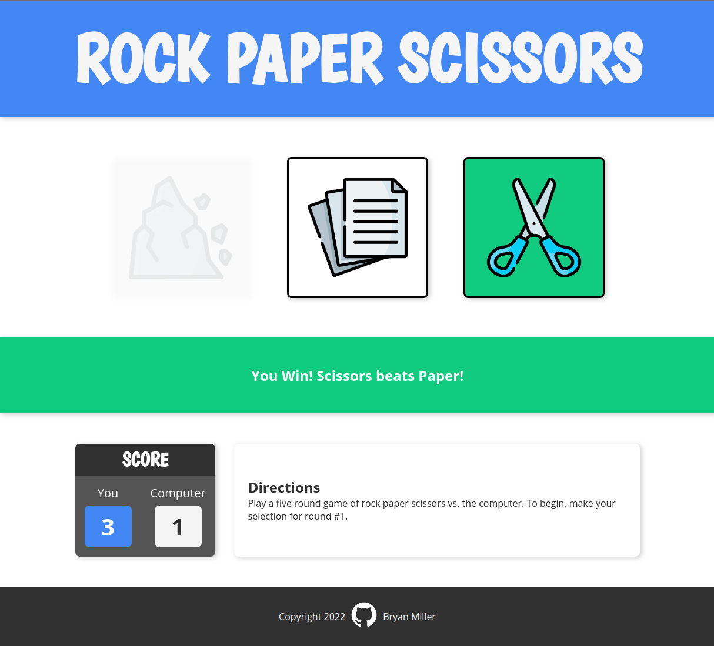
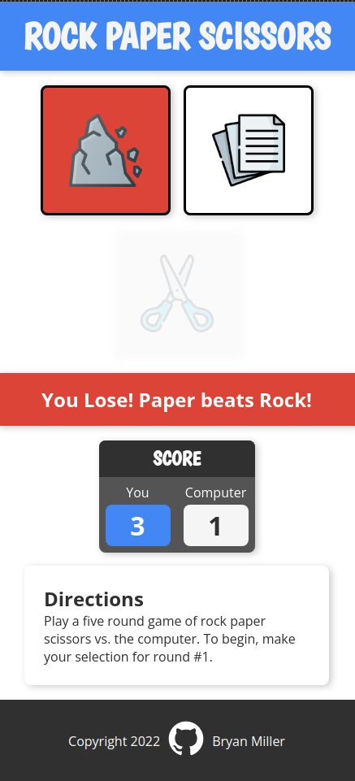

# Odin Project #3: Rock Paper Scissors

Welcome to Bryan Miller's Rock Paper Scissors Project, the [third assignment](https://www.theodinproject.com/lessons/foundations-rock-paper-scissors) within the Odin Project curriculum. The goal of this repo is to practice the following skill sets:

- JavaScript Basics
  - Variables & Scope
  - String & Number Data Types
  - Arrays & `forEach` loop
  - Functions, Parameters & Return Values
  - Strict Equality
  - Comparison Operators
  - Math methods: `floor` & `random`
  - String methods: `toLowerCase`, `toUpperCase`, `charAt`, `replace`
  - Regular expressions
  - DOM Manipulation
    - Event Handlers
    - CSS Style changes
    - Timeouts
    - `querySelector` & `getElementById`
- Chrome DevTools & Debugging
- Problem Solving
  - Clearly defining the problem
  - Creating a plan & writing pseudocode
  - Dividing & conquering: solving sub-problems one by one
  - Connecting sub-problems into a final solution
- [Andy Harris's 'Think like a programmer' technique](https://www.youtube.com/watch?v=azcrPFhaY9k)
- Git Fundamentals

## Links

- [Live Demo](https://bmilcs.github.io/odin-rock-paper-scissors/)
- [My Odin Project Progress](https://github.com/bmilcs/op)

## Screenshots

> Desktop

<table><tr><td>

</td></tr></table>

> Mobile

<table><tr><td>

</td></tr></table>

## Deployment

```sh
git clone git@github.com:bmilcs/odin-rock-paper-scissors.git
```
